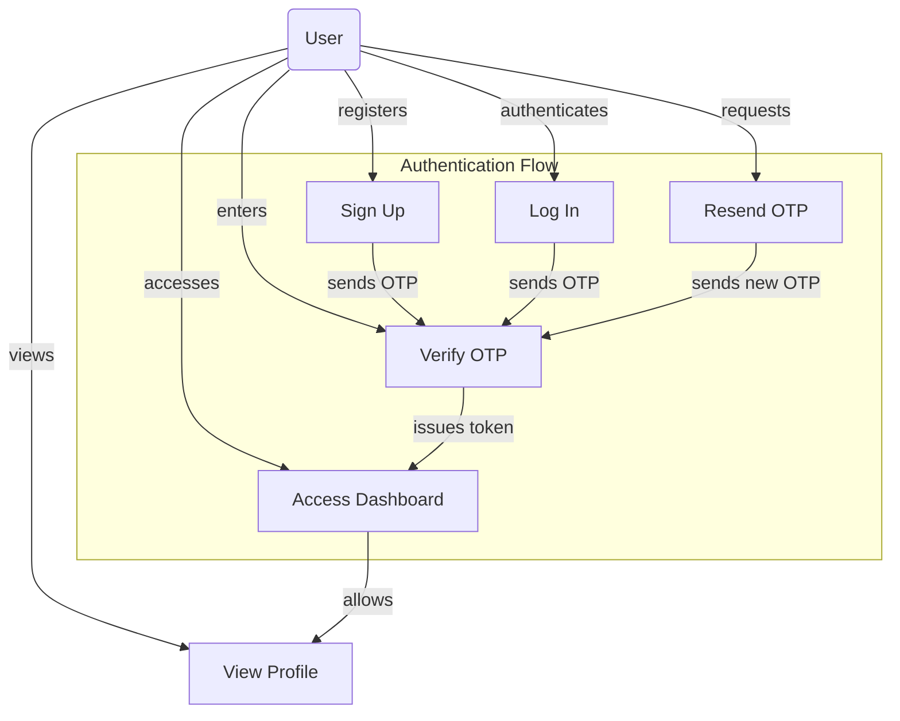
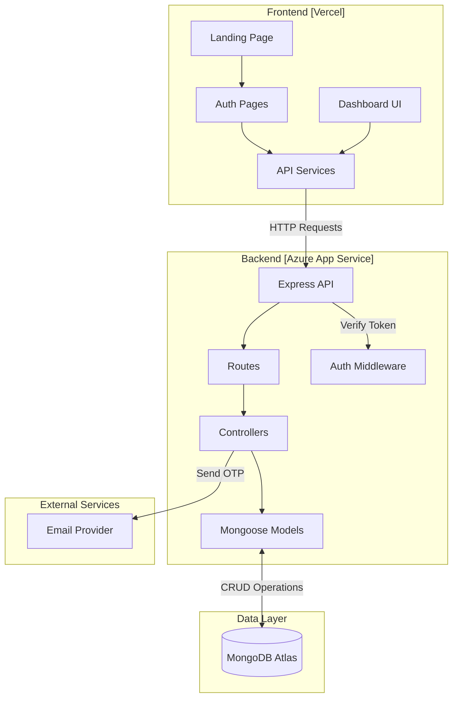
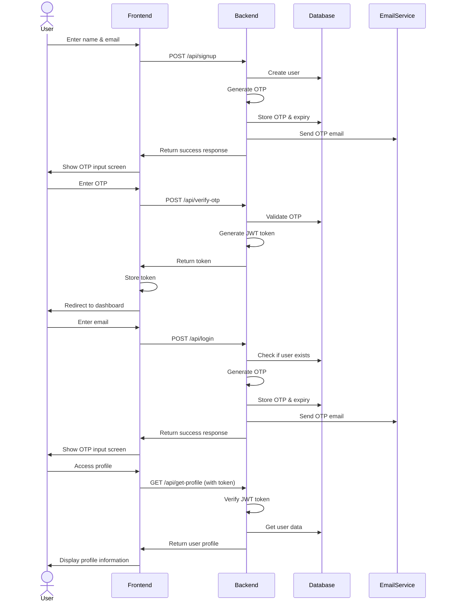
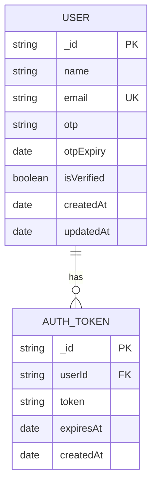

# 🚀 Dashboard Project Documentation

## 📌 Project Overview
The **Dashboard** project is a full-stack web application featuring:
- **Frontend**: Next.js
- **Backend**: Express.js
- **Authentication**: Email-based OTP with JWT
- **UI**: Built using `shadcn/ui` and Tailwind CSS

## 🌐 Live Deployments
- 🔗 Frontend: [Vercel Deployment](https://dashboard-ktgd2xz10-utkarshs-projects-c8d8c56e.vercel.app)
- 🔗 Backend: [Azure Deployment](https://dashboardbackend-hkeed8fudre3eyc3.centralindia-01.azurewebsites.net)
- 🔗 Repository: [Github Repository](https://github.com/utkarshdev2411/Dashboard)

## 🗂️ Project Structure

```
Dashboard/
├── backend/
│   ├── config/
│   ├── controllers/
│   ├── models/
│   ├── routes/
│   ├── utils/
│   ├── .env
│   ├── .env.template
│   ├── .deployment
│   ├── package.json
│   └── server.js
│
├── frontend/
│   ├── public/
│   ├── src/
│   │   ├── app/
│   │   ├── components/
│   │   ├── lib/
│   │   ├── hooks/
│   │   └── services/
│   ├── components.json
│   └── package.json
```

## 🔄 Application Flow



### Step-by-Step Process:
1. User lands on homepage
2. Signs up or logs in using email
3. OTP sent via email
4. User verifies using OTP
5. JWT token is generated
6. Access granted to dashboard
7. Protected routes validate token

## 🏗️ System Architecture



## 🔄 Sequence Diagram



## 🗄️ Database Schema



---

## 🛠️ Backend (Express.js)

### 🔧 Technologies Used
- **Express.js** — Server framework  
- **MongoDB + Mongoose** — Database  
- **JWT** — Token-based authentication  
- **Nodemailer** — Email OTP  
- **CORS** — Secure cross-origin requests

### 📡 API Endpoints
| Method | Endpoint          | Description                  |
|--------|-------------------|------------------------------|
| POST   | `/api/signup`     | Register new user            |
| POST   | `/api/login`      | Send OTP                     |
| POST   | `/api/verify-otp` | Verify OTP and issue JWT     |
| POST   | `/api/resend-otp` | Resend OTP                   |
| GET    | `/api/get-profile`| Get authenticated profile    |

### ⚙️ Setup Instructions
```bash
cd backend
npm install
cp .env.template .env
# Then configure .env manually
npm start
```

#### ✅ Example `.env`

```env
PORT=8000
CORS_ORIGIN=https://your-frontend-url.com
MONGO_URI=mongodb+srv://your-db-uri
JWT_SECRET=your-jwt-secret
SERVICE=gmail
MAIL_ID=your-email@gmail.com
MAIL_PASSWORD=your-app-password
DISPLAY_EMAIL=your-display-email@gmail.com
```

### ☁️ Deployment (Azure)

- Set `SCM_DO_BUILD_DURING_DEPLOYMENT=true`
- Configure environment variables in Azure
- Set proper CORS origin to production frontend URL

---

## 💻 Frontend (Next.js)

### 🔧 Technologies Used

- **Next.js 15**
- **React 19**
- **Axios**
- **shadcn/ui**
- **Tailwind CSS**
- **Framer Motion**

### ⭐ Features

- OTP-based auth
- Protected routes
- Responsive modern UI
- Clean component structure

### ⚙️ Setup Instructions

```bash
cd frontend
npm install
# Create .env.local
echo "NEXT_PUBLIC_API_BASE_URL=http://localhost:8000" > .env.local
npm run dev
# Access at: http://localhost:3000
```

### ☁️ Deployment (Vercel)

- Set `NEXT_PUBLIC_API_BASE_URL` to backend URL
- Configure build settings in Vercel
- Enable auto-deploy from GitHub

---

## 🧩 Common Issues & Fixes

### 🔒 CORS Errors

- Ensure `CORS_ORIGIN` exactly matches frontend URL
- No trailing slashes
- Methods/Headers allowed in backend config

### ❌ 404 Errors (API)

- Check route definitions
- Confirm correct API base URL in frontend
- Ensure backend deployed correctly

### 🔑 Auth Errors

- Match `JWT_SECRET` in backend & frontend
- Check localStorage token handling
- Confirm email config for OTP

---

## 🔄 Development Workflow

1. Run backend (`localhost:8000`)
2. Run frontend (`localhost:3000`)
3. Make updates → Test locally
4. Deploy backend to Azure
5. Deploy frontend to Vercel
6. Final testing on production links

---

## 🔐 Security Practices

- OTP + JWT auth
- Secrets in `.env`
- CORS protection
- No password storage

---

## 🔮 Future Enhancements

- Role-based access control
- Password-based auth as fallback
- User profile settings
- Dashboard analytics
- Reporting features
